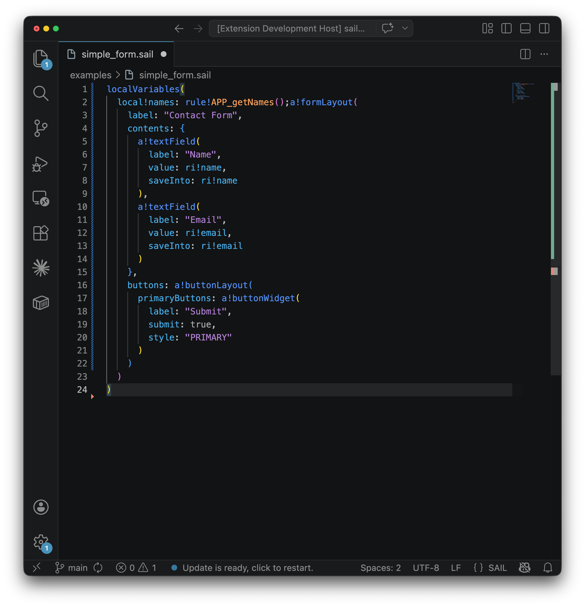

# sail-vscode

Syntax highlighting and document formatting for Appian SAIL (.sail) files. Supports `a!`, `rule!`, `fn!`, `cons!` functions, all variable prefixes (`local!`, `ri!`, `fv!`, etc.), record type URNs, strings, comments, and more.



## Installation

### From source

1. Clone this repository
2. Run `npm install` and `npm run compile`
3. Symlink the folder into your VS Code extensions directory:
   - macOS/Linux: `~/.vscode/extensions/`
   - Windows: `%USERPROFILE%\.vscode\extensions\`
4. Restart VS Code

### From .vsix file

1. Download the latest `.vsix` from the [releases page](https://github.com/samuria/sail-vscode/releases)
2. In VS Code, open the Command Palette (`Cmd+Shift+P` / `Ctrl+Shift+P`)
3. Run "Extensions: Install from VSIX..." and select the file

## Usage

Open any `.sail` file and syntax highlighting will apply automatically.

To format a file, press `Shift+Option+F` (macOS) or `Shift+Alt+F` (Windows/Linux). You can also right-click in the editor and select "Format Document".

To format on save, add this to your VS Code settings:

```json
{
  "[sail]": {
    "editor.formatOnSave": true
  }
}
```

## Todo

- [ ] Validation (server-side and client)
- [ ] Record type collapse

## License

MIT
